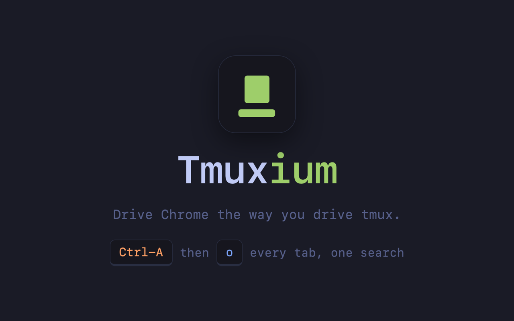
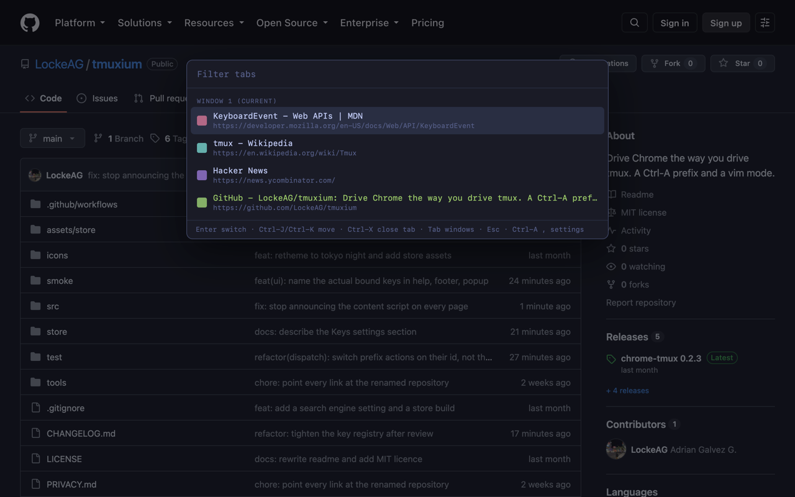
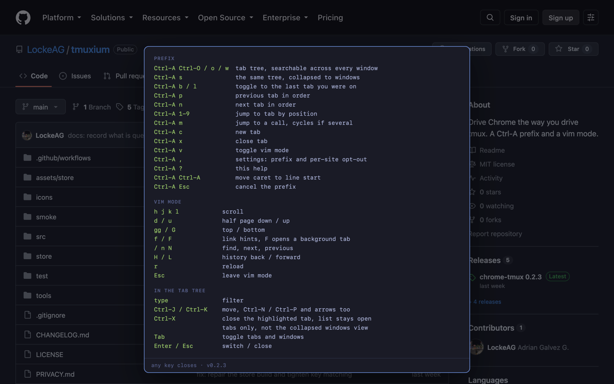
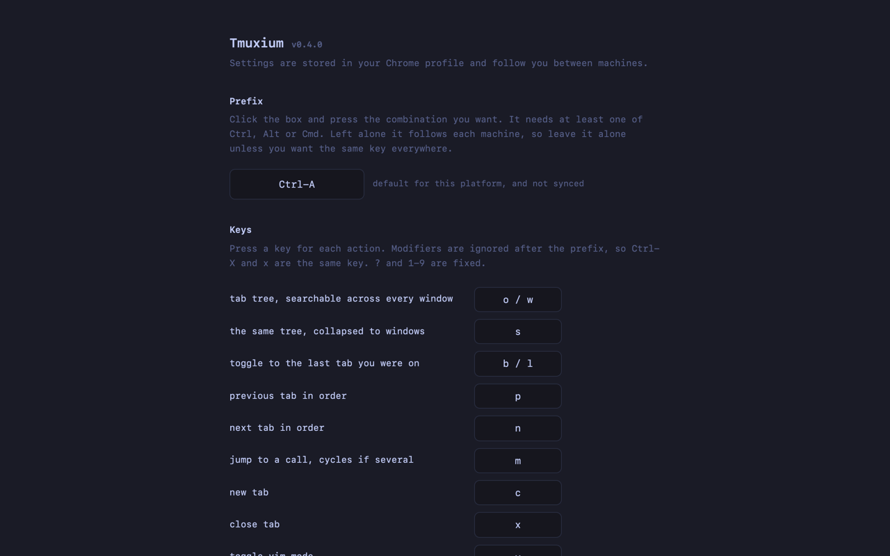

# chrome-tmux

[](https://github.com/LockeAG/chrome-tmux/actions/workflows/ci.yml)



Drive Chrome the way you drive tmux. Hit `Ctrl-A`, then a letter.

No build step, no runtime dependencies, no network calls. Chrome loads the
source as written. Types are checked with `// @ts-check` and JSDoc, so there is
nothing to compile.

**The prefix owns containers. Vim mode owns the page.** A Chrome tab is a tmux
window, a Chrome window is a tmux session, so `Ctrl-A w` lists your tabs the way
`prefix w` lists your windows.

## Install

```fish
git clone git@github.com:LockeAG/chrome-tmux.git
open -a "Google Chrome" chrome://extensions
```

Developer mode on, **Load unpacked**, pick the folder. Tabs you already had open
start working straight away.

## What it looks like

`Ctrl-A` then `Ctrl-O`: every tab in every window, filtered as you type.



`Ctrl-A` then `?`: every key, drawn in the page.



`Ctrl-A` then `,`: rebind the prefix, or switch the extension off per site.



## Prefix

Press `Ctrl-A`, let go, then one of these. `-- PREFIX --` shows bottom-left while
it waits. No timeout, same as tmux.

| Key | What it does |
| --- | --- |
| `Ctrl-O` / `o` / `w` | the tab tree, searchable across every window |
| `s` | the same tree, one row per window |
| `b` / `l` | toggle back to the last tab you were on |
| `p` / `n` | previous / next tab in order |
| `1`-`9` | jump to a tab by position |
| `m` | jump to a call, cycles if there are several |
| `c` | new tab |
| `x` | close this tab |
| `v` | vim mode on or off |
| `,` | settings |
| `?` | show every key, in the page |
| `Ctrl-A` | jump the caret to the start of the line |
| `Esc` | cancel, having pressed the prefix by mistake |

## Vim mode

Bare keys, no prefix. `-- VIM --` shows bottom-left. It stands aside while a
text box has focus, so typing in a search field never scrolls the page.

| Key | What it does |
| --- | --- |
| `h` `j` `k` `l` | scroll |
| `d` `u` | half a page down or up |
| `gg` `G` | top, bottom |
| `f` / `F` | link hints, `F` opens in a background tab |
| `/` `n` `N` | find, next, previous |
| `H` `L` | back, forward |
| `r` | reload |
| `Esc` | leave vim mode |

## In the tab tree

| Key | What it does |
| --- | --- |
| type | filter |
| `Ctrl-J` / `Ctrl-K` | move, `Ctrl-N` / `Ctrl-P` and arrows too |
| `Ctrl-X` | close the highlighted tab, list stays open |
| `Tab` | toggle tabs and windows |
| `Enter` `Esc` | switch / close |

The footer inside the list repeats these, and points at the settings. It names
whichever prefix you have set, not the default.

Plain `j` and `k` cannot move: the filter box has focus, so they would type
letters. `Enter` on a window row brings that window forward and leaves its own
tab alone.

## Calls come first

A live call is hoisted to the top under **In a call**, tinted, with a dot that
turns green while the tab is making sound. `Ctrl-A m` skips the tree and jumps
straight there.

Recognised from the URL, so a meeting counts and a landing page does not. Meet,
Zoom, Teams, Webex, Chime, GoTo, BlueJeans, Skype, Jitsi, Around, Gather. One
array in `src/calls.js`, with a test beside it.

## Settings

`Ctrl-A` then `,`. Or right-click the toolbar icon and pick Options, or open
Settings from the popup.

**Prefix.** Click the box and press what you want. Left alone it follows each
machine: `Ctrl-A` on macOS, `Alt-A` elsewhere, because `Ctrl-A` is select-all on
Windows and Linux. Set one deliberately and it syncs everywhere, which is what
you want only if you use the same key on every machine. The site list always
syncs.

**Search engine.** Used by the new tab page. Pick a preset or write your own
URL with `%s` where the query goes.

**Sites to stay out of.** One host per line. `mail.google.com` matches that
host, `*.figma.com` matches the domain and everything under it. On those sites
no key is intercepted at all.

It ships with a starting list, because a spreadsheet needs `Ctrl-A` more than a
tab switcher does: Gmail, Google Docs, Office on the web and SharePoint,
Overleaf, Notion, Figma, Slack, and the two browser editors, `vscode.dev` and
`github.dev`. They are shown in the box, not hidden, so delete any you disagree
with. Empty the list entirely and it stays empty.

## The one annoying trade

The prefix is taken on every page it runs on, inside text boxes too, so with the
macOS default you lose "jump to the start of the line". Press the prefix twice
to get it back, like `send-prefix` in tmux. Or rebind it, or add the site to the
list above.

## The new tab

Chrome forbids extensions from running on its own pages, so this brings its own
new tab: a search box and your most visited sites, with every key working.

Chrome parks the cursor in the address bar on an overridden new tab. The page
takes focus back as it loads. If one ever ignores you, click it once.

## Rough edges, honestly

- `chrome://` pages, the Web Store and the PDF viewer are dead. No way round it.
  Binding a browser-level shortcut makes it worse, not better: Chrome would then
  swallow the prefix before any page sees it.
- Keys in the omnibox belong to Chrome, not to the page.
- The keymap beyond the prefix is not configurable; it lives in the source.
- Link hints skip iframes. Find uses `window.find`, old and unofficial.
- No counts like `3j`, no marks.
- Teams only matches its join page; it rewrites the URL once you are in a call.
- Discord and Slack are absent from call detection on purpose. A voice channel
  or a huddle does not change the URL, so any pattern would flag every channel
  you have open. Slack is on the default site list for a separate reason: it
  wants its own keys.
- `Ctrl-X` reports success as soon as Chrome accepts the close. A page that
  stops you leaving with a dialog can survive it and reappear in the list.
- **What you type into the tab filter is visible to the page you are on**, if
  that page listens for keys in the capture phase. The overlay lives in a closed
  shadow root, so the page cannot read the list or the results, but the
  keystrokes travel through its document on the way in. Closing that properly
  means moving the overlay into an iframe, which is the plan; until then, do not
  filter by anything you would not type into the page itself.

## Privacy and security

No network requests, no remote code, no `eval`, nothing collected. It reads tab
titles and URLs because that is what a tab switcher does, and they never leave
your browser. The interface lives in a closed shadow root, so pages cannot read
or restyle it. Full detail in [PRIVACY.md](PRIVACY.md).

Two things it does on purpose, both the result of a security audit:

- **Only real keystrokes count.** A page can dispatch keyboard events at will.
  Without an `isTrusted` check any site you visited could arm the prefix and
  close your tab or spawn tabs on its own. Synthetic events are ignored.
- **The tab list shows a colour, not a favicon.** Loading each site's real icon
  would put one request per open tab into the host page's resource timeline,
  letting the page you are on read the hostnames of every tab you have open. The
  colour is derived from the hostname, so nothing is fetched.

## Development

```fish
pnpm test                                          # typecheck, then the test suite
pnpm smoke                                         # load it in a real Chrome
pnpm build:store                                   # dist/, without the new tab
npm run typecheck                                  # types only
node tools/make-icons.cjs icons                    # extension icons
node tools/make-screenshots.mjs                     # store screenshots
node tools/make-promo.cjs <capture> assets/store   # cover and promo tiles
```

The store build is deliberately narrower: `pnpm build:store` writes `dist/`
without the New Tab Page, which drops the `topSites` and `favicon` permissions
and the override that makes a review slow. The repo keeps the full extension;
load that unpacked. Seven tests check the two cannot quietly diverge, and three of them load the
store build in a real browser rather than reading its file list. That matters:
the build once shipped a settings page that threw on its first line, and every
file-list check passed.

`tools/promo.html` is the cover art. Serve it, capture it at any size, and
`make-promo.cjs` cuts it into the cover, tile and marquee.

Capturing screenshots: a browser screenshot comes back around 1512px wide
however large the viewport is, so on a big display the interface is downscaled
to mush before anything else runs. Zoom the page first, then capture:

```js
document.documentElement.style.zoom = '3'
```

## Publishing

[store/listing.md](store/listing.md) holds the Chrome Web Store copy: the
description, the single-purpose statement, a justification for each permission,
and what to answer on the data-use form. The submission is the `dist/` build,
which asks for `tabs`, `storage` and `scripting` where the repo build also asks
for `topSites` and `favicon`. Both request the `<all_urls>` host permission.

## Changelog

[CHANGELOG.md](CHANGELOG.md).

## Licence

MIT.
